# K armed bandit

It is used to formulate the problem statement for the reinforcement learning. 

Example - A doctor (agent) gives 3 different treatment (action), and the result is an unknown reward (until the real result is obtained). One of the treatement makes the patient better (higher reward), and the other 2 will not help the patient (treatment can be discarded). This is the real result or real reward.

Definition - Agent choses K different action and received an award for each action. The agent should take action based on expectation of the unknown reward (i.e. action value).

# Action values:

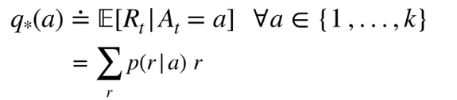

q*(A) - The true action value 

Definition - The action value is defined as the expected reward for a given action. The goal is to maximize q*.

It is not known beforehand by the agent. 

NOTE:
1. The true action value (q*) is not known by the agent. It is known only in the simulation usually set tby the programmer / simulator. It is required only for evaluating the agent's performance like % optimal action.
2. The estimated action value (Q) is known by the agent.

## Estimating the action value (Sample average & Exponential average of rewards)

### Method 1 - Sample average method 

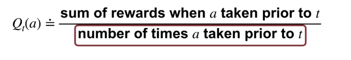

It is the ratio of the sum of rewards when action is taken and the number of actions taken. (average)

The rewards can be any numerical representation, but often negative is penalty and positive is victory.

Example - A doctor creates a table with rewards whenever a patient feels better with a treatment. 

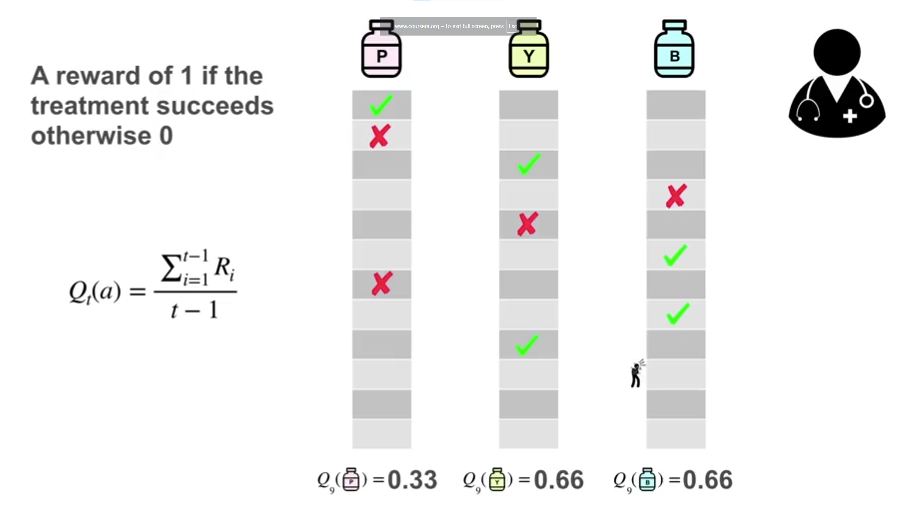

The greedy action is the action with the highest value of the action value estimate. The agent cannot explore (investigate non greedy actions) and exploit (investigate only the greedy action) at the same time, which is a typical problem in reinforcement learning. 

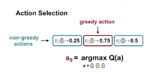

### Method 2 - Incremental update (page 53)

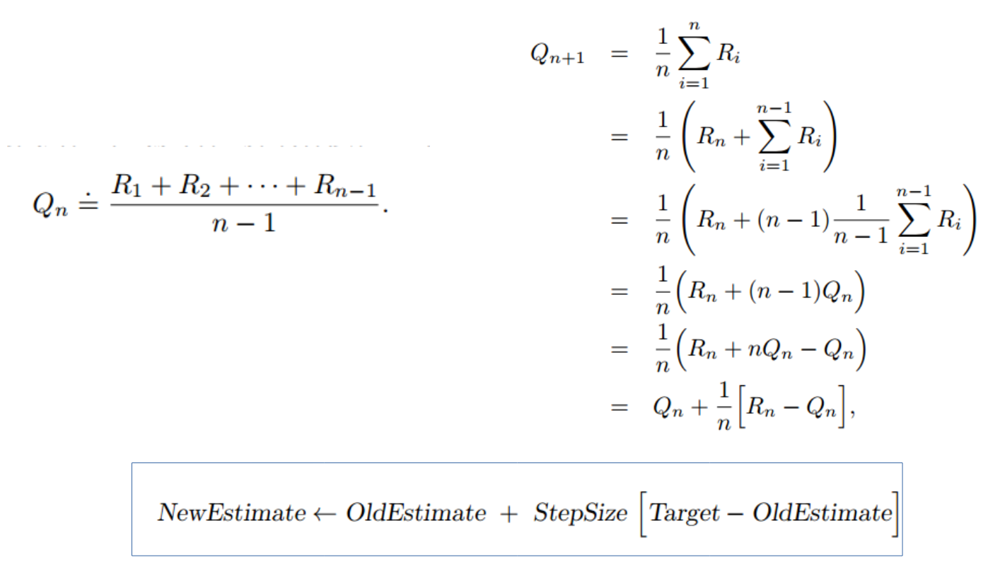

Q - Estimate of the action value  
R - Rewards
n - Number of times the action has performed

The incremental update is just a exponential average of the rewards taken over time.

(Target - OldEstimate) is an error in the estimate. The target is the nth reward. 

The step size affects the convergence towards the mean. There are 2 methods to set this value:

1. Decaying Step Size - The step size changes from time step to teme step and is normally set to $\frac{1}{N(A)}$. ($N(A)$ - It is the number of times an action A is performed). It works well for stationary problems (where the true action value remains same over time) but fails on non stationary because when N(A) gets large, the step size is very small. 
2. Constant step size - It equally weights all the rewards. It is suitable for non stationary problems.

It is possible to decay the old rewards based on the distribution of the rewards (ex - when a treatment works better in winter). When step size is constant and closer to 1, then the recent reward have higher weight. 

Pseudocode:  
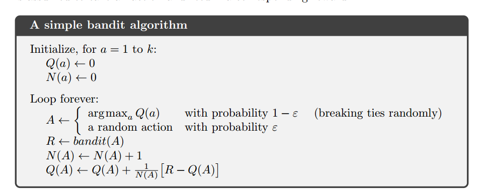

# Exploration vs exploitation

Exploration - Investigates all the actions irrespective of the rewards. Useful when the conditions are changing.

Exploitation - Investigate the action with the best rewards. Ignores other actions. 

Both cannot be done simultaneously.

When to choose exploration and exploitation? How to balance them ?

## 10 armed testbed

It is a method to find the effectiveness of a method to balance the explore vs exploit. The KPIs are average reward and % optimal action. 

The general steps to perform the test are:
1. Select K=10 actions (arms) 
2. For every new run, randomly generate the true expected reward ($q_*(A)$) for each of the 10 arms from a standard normal distribution, $\mathcal{N}(0, 1)$.
3. For every run, the agent executes the chosen policy (e.g., $\epsilon$-greedy) for $T=1000$ time steps (or iterations)
4. Repeat the experiment for $M$ independent runs (e.g., $M=2000$).
5.  Take the average of the chosen performance metric (e.g., Average Reward or % Optimal Action) across all $M$ runs, giving one averaged value per time step.

% Optimal action - The action at every timestep is checked whether it is the action with the highest expected action value(optimal action). It is repeated for different runs. The average is calculated across different runs for a given timestemp:

$$\%\text{ Optimal Action}_t = \frac{\sum_{m=1}^{M} O_t^{(m)}}{M} \times 100$$
 
 Where:$O_t^{(m)}$ is the binary outcome (1 or 0) for run $m$ at time step $t$.$M$ is the Total number of runs (e.g., 2000).

## Method 1 - Epsilon greedy

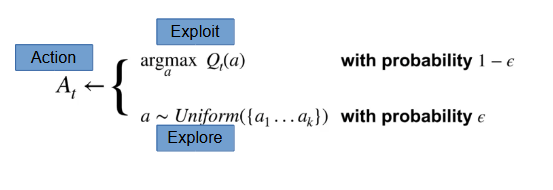

A simple method to balance exploit and explore. 

The effectiveness of this method can be determined by using 10 armed test bed for different values of epsilon:

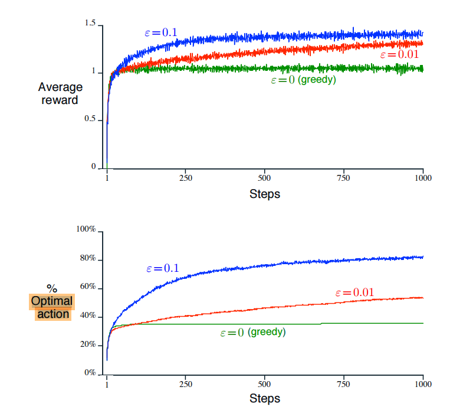

## Method 2 - Optimistic initial values

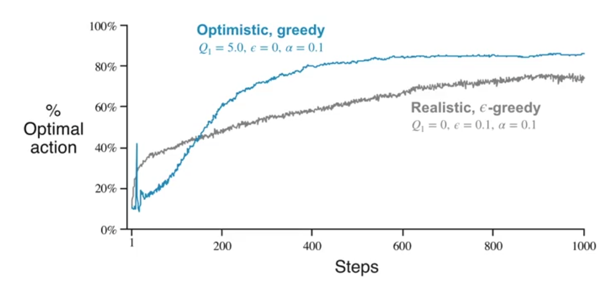

The idea is to explore at the initial time steps and exploit at later timesteps. 

Limitation:
1. Fails when the environment is still changing during the exploitation phase. 
2. Difficult to set the optimistic initial values as we may not know the maximum reward. 

## Method 3 - Upper confidence bound Action selection

The use of exploration in epsilon greedy is very random. A better way to approach this problem is to use uncertainty of the estimate of action value. The idea is to treat uncertain estimates are "optimistically good" and explore the corresponding action. The action selection can be done using the formula:

$$A_t = \underset{A}{\operatorname{argmax}} \left[ \underbrace{Q_t(A)}_{\text{Exploitation Term}} + \underbrace{c \sqrt{\frac{\ln t}{N_t(A)}}}_{\text{Exploration Term}} \right]$$

For a given timestep, perform the action that maximizes the sum of exploitation (current estimate) and exploration (uncertainty).

The exploration term or the uncertainty checks how much times the action is preformed during all the timesteps. If the difference between N and t is small then low uncertainty and vice versa.

$$\text{Uncertainty} = c \sqrt{\frac{\ln (\text{Total Time Steps } t)}{\text{Tota number times an action A is performed previously}}}$$

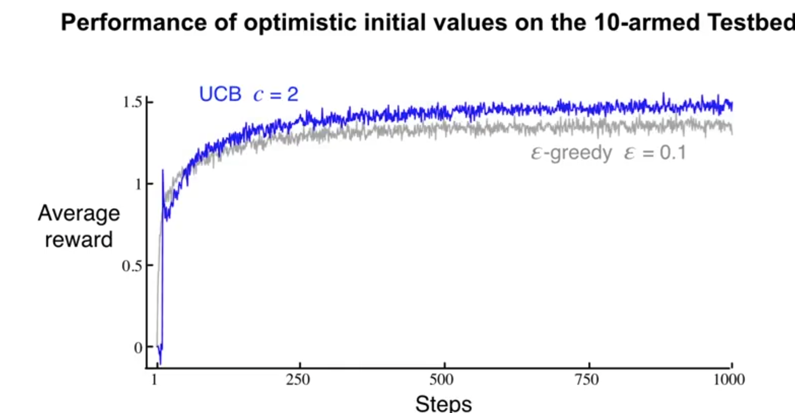

UCB performs better than epsilon greedy after 100 steps. UCB reduces exploration over time but epsilon greedy has a 10% prob of exploring. 

# Real world reinforcement learning

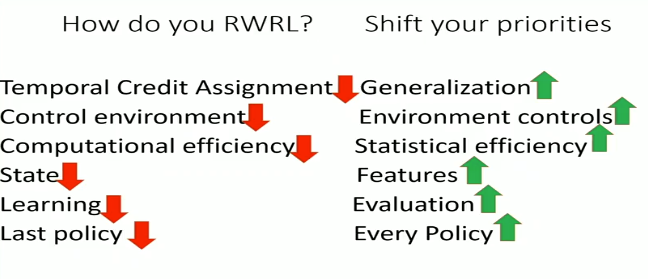

# Summary

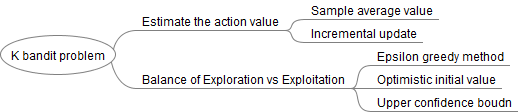

