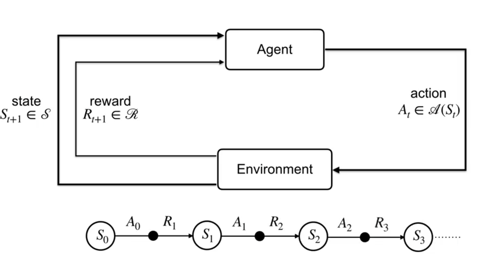
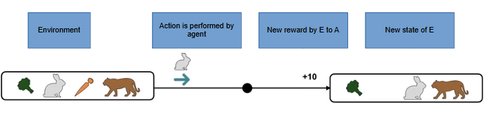

# Markov decision process (MDP)

At each timestep, the agent A intereacts with the environment E and receives the state of the environment S. Based on this state S_t, the agent performs an action A_t. One timestep later (t+1), the agent is in a different state of environment S_t+1 and the environment provides a reward R_t+1.

THe markov property states that the present state contains all the information about the future and it need not require past information.

The probabilty of state will be $s'$ and r given the current state and action:

$$p(s', r \mid s, a) \doteq \Pr\{S_t = s', R_t = r \mid S_{t-1} = s, A_{t-1} = a\}$$

Example:

# Difference between K armed bandit and MDP

In the above image, lets consider that the carrot is the agent. The reward for eating the carrot is +10, brocolli is + 3, and being close to tiger is -100. So the logical action is to be away from the tiger.

The K armed bandit will be interested only in the immediate reward, ex - the rabbit eats the carrot (+10) but disregards the future consequences (tiger eats rabbit -100) --> Total reward = -90. Whereas the MDP considers the future reward too. Therefore, the rabit eats brocolli (+3) --> Total reward = +3.

# Goal of Reinforcement learning

The agent's objective is to maximize the future reward. 

Return is the sum of rewards obtained after certain number of timesteps and it is stochastic is nature. It helps the algorithm to focus on long term rewards rather than immediate rewards. 

Episodic tasks are the tasks that have same initial starting positions but different end positions. The undiscounted return at timestep t is given by:

$$G_t = R_{t+1} + R_{t+2} + R_{t+3} + \dots + R_T$$

Continuing task are the tasks that have no final position (Ex - Automatic thermostat). The discounted return at timestep t will depend on infinite rewards:

$$G_t = R_{t+1} + \gamma R_{t+2} + \gamma^2 R_{t+3} + \dots = \sum_{k=0}^{\infty} \gamma^k R_{t+k+1}$$

where 10 $0 \leq \gamma \leq 1$ 

## Reward hypothesis

